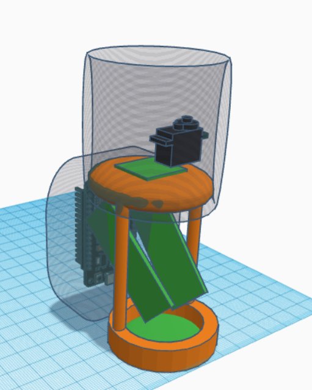
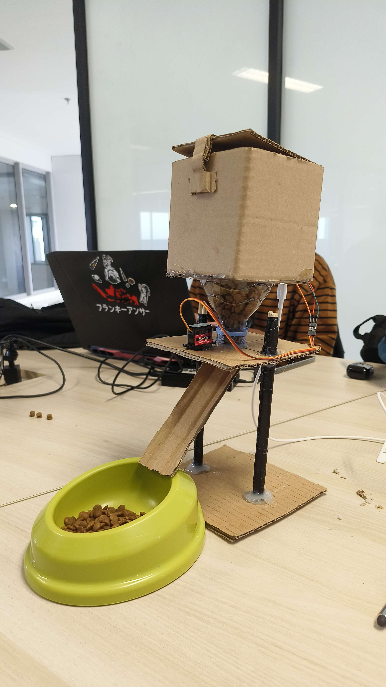

# 🐾 Smart Pet Feeder IoT System

An automatic pet feeding system that combines IoT hardware with a mobile app, allowing pet owners to remotely control and schedule feeding times for their pets.

## 📱 Features

- **Remote Control**: Feed your pet from anywhere using the mobile app
- **Scheduled Feeding**: Set automatic feeding times
- **Real-time Monitoring**: Check feeding history
- **WiFi Connectivity**: Connect via ESP32 for internet access
- **User-friendly Mobile App**: Intuitive Android interface

The system consists of two main components:
1. **IoT Device** (ESP32 + Servo) - Controls the physical feeding mechanism
2. **Mobile App** (Android) - Provides user interface and remote control

## 🛠️ Hardware Components

- ESP32 Development Board
- Servo Motor (for dispensing mechanism)
- Pet food container/hopper
- Power supply
- Connecting wires and breadboard




## 📸 Screenshots

| Home Screen | Feeding Control | Schedule Setup |
|-------------|-----------------|----------------|
|  |  |  |


## 📖 Usage

1. Power on the ESP32 device
2. Connect your phone to the same WiFi network
3. Open the mobile app
4. Connect to your pet feeder device
5. Use the app to:
   - Feed your pet manually
   - Set up feeding schedules
   - Monitor feeding history

## 🔧 Configuration

### WiFi Setup
Update the WiFi credentials in the firmware:
```cpp
const char* ssid = "your-wifi-name";
const char* password = "your-wifi-password";
```

### App Configuration
Configure the ESP32 IP address in the mobile app settings.

